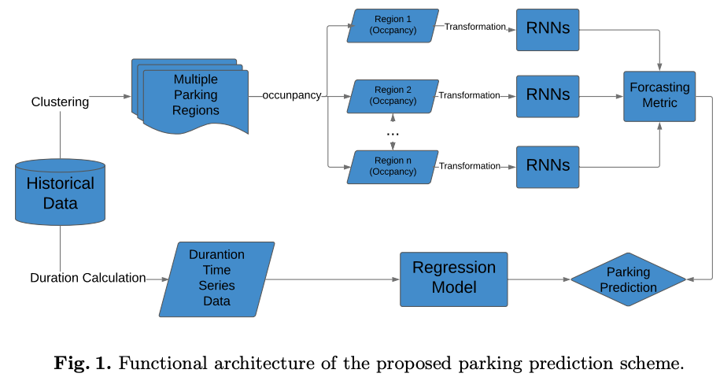

# Parking Availability Prediction with Long Short Term Memory Model
*International Conference on Green, Pervasive, and Cloud Computing*
## Dataset
### Form
Contineous time-series occupancy $\{O_1, ..., O_t\}$, where $O_t \in [0, 1]$ with a time duration $D_t$.
### Static parking sensors
Yes
### Topological information
The parking area has been clustered into different zones with simiar parking patterns. The connectivity of blocks are NOT used!
### Time granularity
Each zone has different duration $D_t$.
### Location
Melbourne and San Francisco
## Architecture

## Model 
recurrent neural networks (RNNs) 
## Approach / Experient
This paper address the problem of diverse parking patterns in different zones. For each zone, a RNN has been deployed for future parking occupancy prediction based on the historical time-series parking occupancy. The author argues that RNN performs better than a static MLP.
### Evaluation metrics
+ Mean absolute error (MAE)
+ Root mean squared error (RMSE)
+ Mean absolute percentage error (MAPE)
+ Root relative squared error (RRSE)